# Stroke_Index_Page

The stroke scenarios or cases can be launched from this page by clicking on the Start button.

## Stroke Scenarios

- Holly Hill
- Ravi Kumar
- Lucy Locklear
- Natalia Batista
- Ross Bennett
- Nam Truong
- Adair Cantanton
- Leone Abrams

```mermaid
graph TD
    A[stroke-index]
    A1[.gitignore]
    A2[package.json]
    A3[README.md]
    A4[Stroke_Index_Page.code-workspace]
    A5[tsconfig.json]
    A6[public]
    A7[src]

    A --> A1
    A --> A2
    A --> A3
    A --> A4
    A --> A5
    A --> A6
    A --> A7

    A6 --> B1[index.html]
    A6 --> B2[manifest.json]
    A6 --> B3[robots.txt]
    A6 --> B4[assets]
    B4 --> C1[cards-img]
    B4 --> C2[stroke]
    C2 --> D1[icons]

    A7 --> E1[App.css]
    A7 --> E2[App.test.tsx]
    A7 --> E3[App.tsx]
    A7 --> E4[assets]
    A7 --> E5[components]
    A7 --> E6[extendedstyles.ts]
    A7 --> E7[index.css]
    A7 --> E8[index.tsx]
    A7 --> E9[react-app-env.d.ts]
    A7 --> E10[reportWebVitals.ts]
    A7 --> E11[scenariosUrls.ts]
    A7 --> E12[setupTests.ts]
    A7 --> E13[strokePatientsData.ts]
    A7 --> E14[theme.css]
    A7 --> E15[theme.ts]
    A7 --> E16[tIdConstants.tsx]

    E4 --> F1[stroke]

    E5 --> G1[NameWithIcon.tsx]
    E5 --> G2[ScenarioCard.tsx]
    E5 --> G3[StrokeIndexTopBar.tsx]
    E5 --> G4[TipsBox.tsx]
    E5 --> G5[TipItem.tsx]

```

